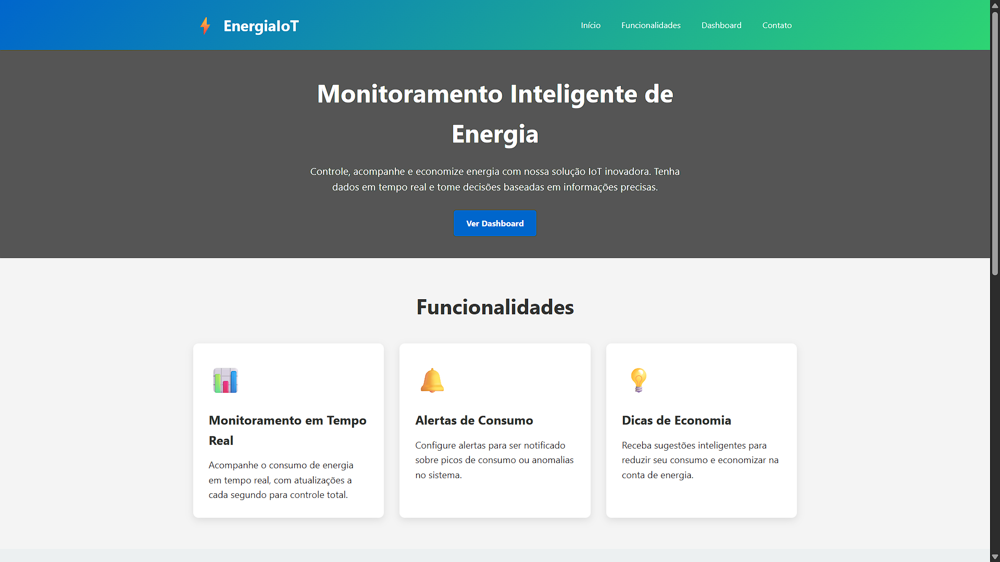
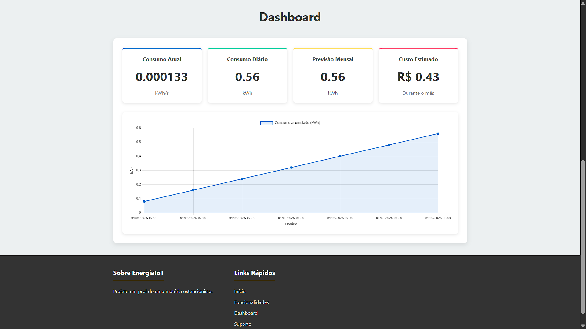
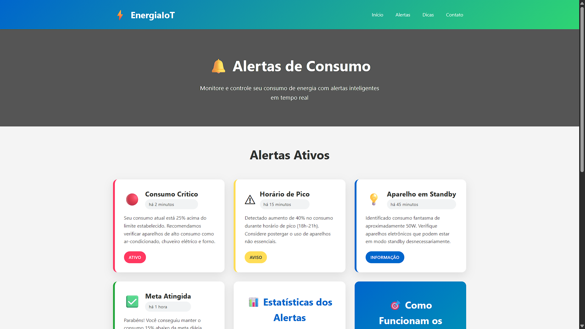
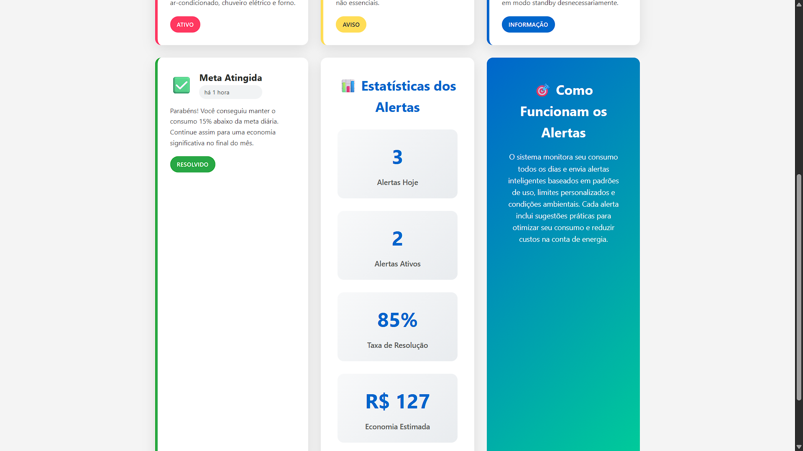
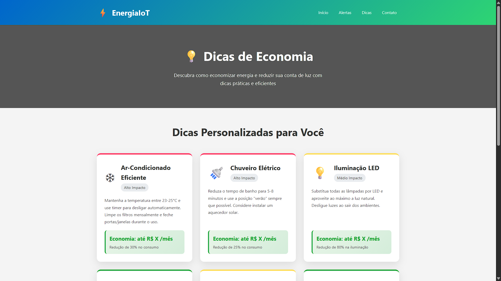
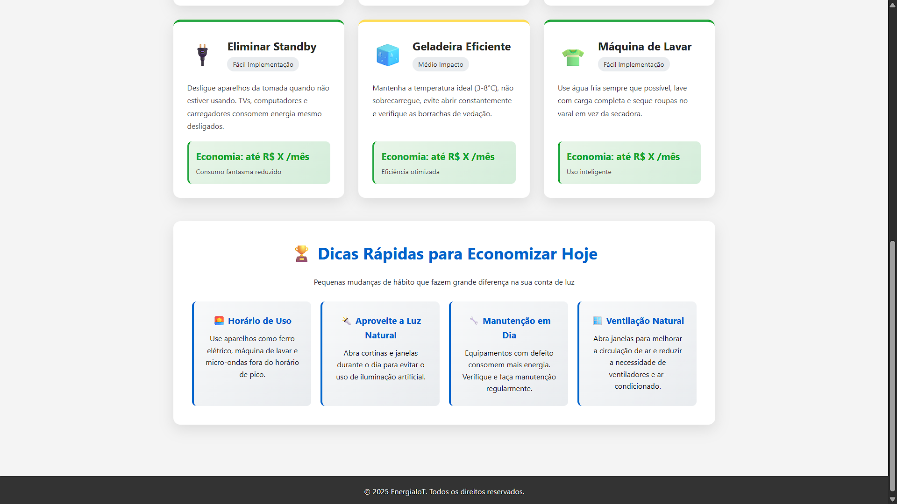
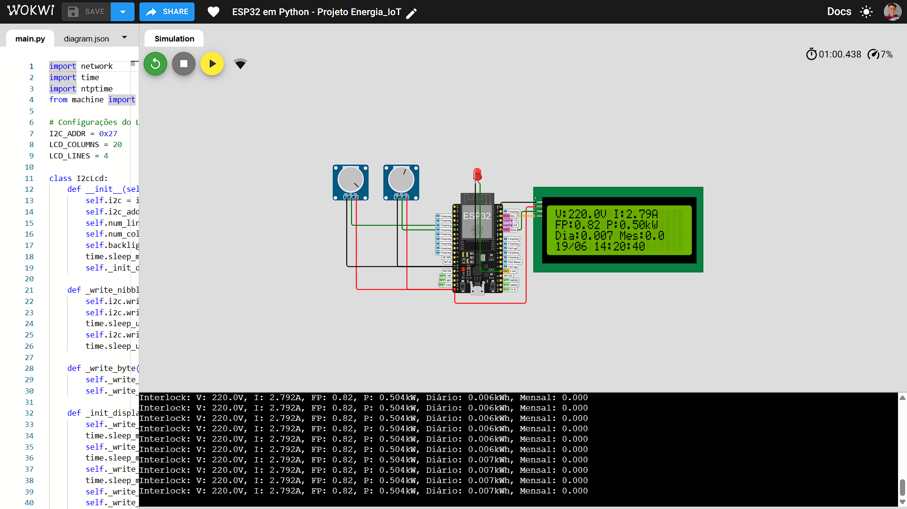

# Energia IoT 🔌📊

Este projeto tem como objetivo oferecer uma solução acessível e funcional para monitoramento de consumo de energia elétrica utilizando tecnologias da Internet das Coisas (IoT), simulado em ambiente virtual.

## 📌 Sobre o Projeto

O projeto foi desenvolvido como atividade de extensão universitária. Ele simula o comportamento de um sistema físico capaz de medir o consumo de energia elétrica em tempo real e exibir os dados em uma interface web intuitiva.

A motivação veio da necessidade de uma cliente real (costureira) que enfrenta altos custos com energia elétrica e buscava uma solução prática para acompanhar e controlar o consumo diário.

## 🧰 Tecnologias Utilizadas

- ESP32 (simulado)
- Python (backend simulado)
- HTML, CSS e JavaScript (interface web)
- Wokwi (ambiente de simulação de hardware)
- Potenciômetros como substitutos do sensor PZEM-004T

## 📋 Funcionalidades

- Medição simulada de consumo (tensão, corrente, potência)
- Visualização de dados em tempo real via interface web
- Alertas de consumo excessivo
- Dicas de economia de energia

## 💻 Execução

O projeto é composto por duas partes independentes:

1. *Simulação no Wokwi*  
   Representa a parte de hardware (ESP32 + LCD + potenciômetros simulando o sensor).

2. *Interface Web*  
   Frontend desenvolvido para visualizar dados e alertas. Os dados são simulados e não estão integrados ao hardware virtual.

> ⚠ A integração entre hardware e web não foi realizada devido à limitação do ambiente Wokwi, mas está prevista na arquitetura do projeto.

## 📷 Demonstração

  
  
  
  
  
  
  

## 👤 Autor

- Inácio Junio Santos de Lima – [GitHub](https://github.com/JunioSantos005)

## 📄 Licença

Este projeto é livre para fins educacionais.